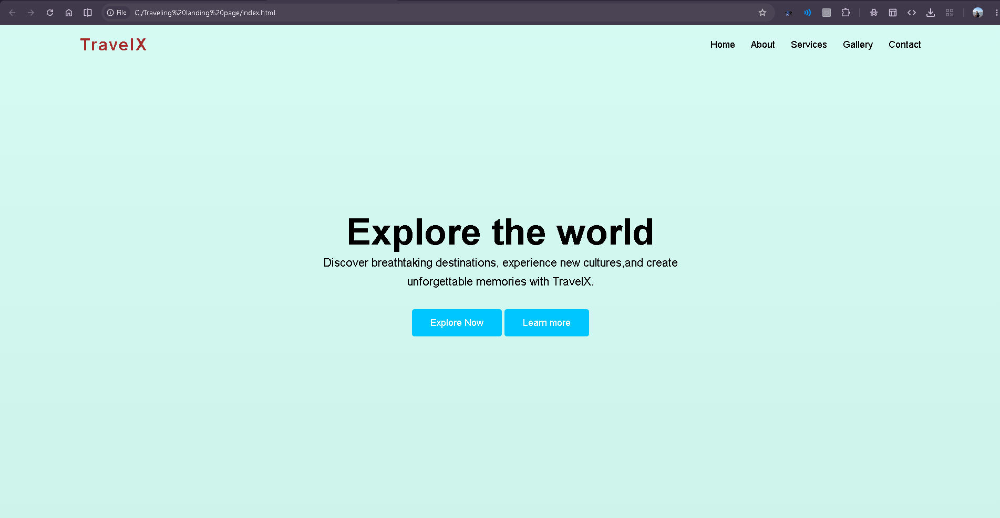
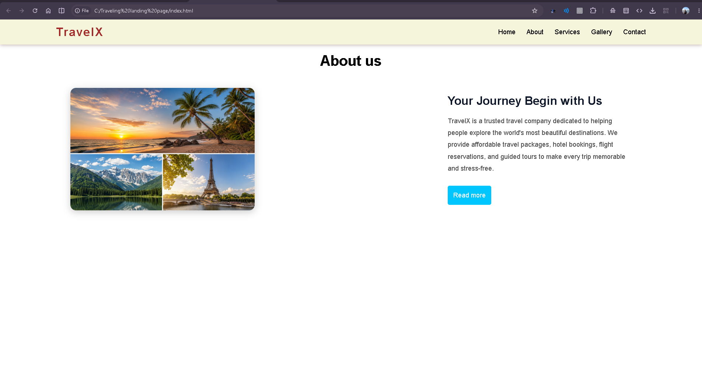
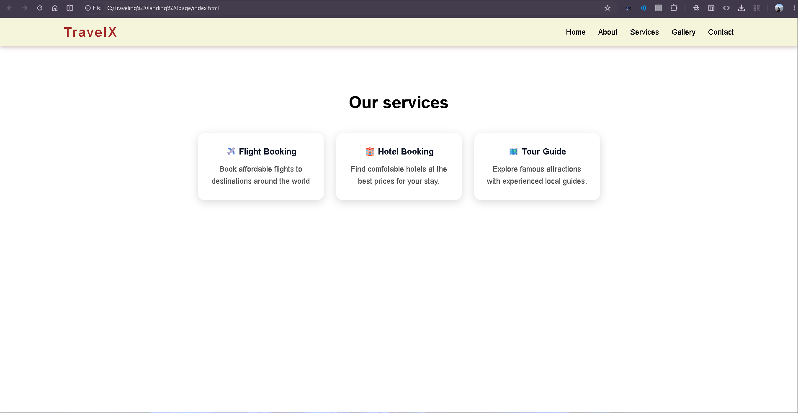
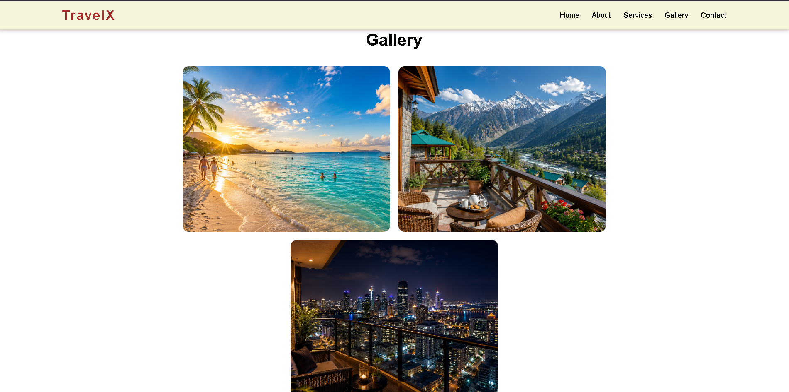
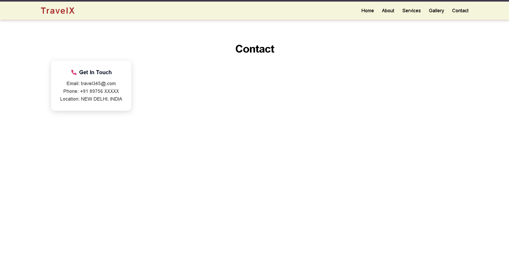

# SCT_WD_1
Responsive Landing Page using HTML, CSS and JavaScript

# 🌍 TravelX - Responsive Landing Page

A modern and responsive travel landing page built using **HTML**, **CSS**, and **JavaScript** as part of **SkillCraft Technology Web Development Internship - Task 01**.

## 📌 Project Overview

TravelX is a simple travel website that showcases popular travel destinations with a clean and responsive user interface. The project demonstrates modern front-end development concepts including responsive layouts, fixed navigation, hover effects, smooth scrolling, and interactive UI elements.

---

## 🚀 Features

- ✅ Fixed Navigation Bar
- ✅ Navigation Bar Changes Color on Scroll
- ✅ Hover Effects on Navigation Links
- ✅ Smooth Scrolling Navigation
- ✅ Responsive Hero Section
- ✅ About Section
- ✅ Service Cards with Hover Animation
- ✅ Gallery Section
- ✅ Contact Section
- ✅ Responsive Footer
- ✅ Mobile Responsive Design

---

## 🛠️ Technologies Used

- HTML5
- CSS3
- JavaScript (Vanilla JS)

---

## 📂 Project Structure

```
SCT_WD_1/
│
├── index.html
├── style.css
├── script.js
│
├── images/
│   ├── hero.jpg
│   ├── about.jpg
│   ├── beach.jpg
│   ├── mountain.jpg
│   └── city.jpg
│
└── screenshots/
    ├── home.png
    ├── about.png
    ├── services.png
    ├── gallery.png
    └── contact.png
```

---

## 📸 Screenshots

### 🏠 Home Page



---

### ℹ️ About Section



---

### 💼 Services Section



---

### 🖼️ Gallery Section



---

### 📞 Contact Section



---

## ▶️ How to Run the Project

1. Download or clone the repository.

```
git clone https://github.com/ansh965-code/SCT_WD_1.git
```

2. Open the project folder.

3. Double-click **index.html** or open it using **Live Server** in VS Code.

---

## 📱 Responsive Design

The landing page is fully responsive and works smoothly on:

- Desktop 💻
- Tablet 📱
- Mobile 📱

---

## 🎯 Internship Task

This project was developed for:

**SkillCraft Technology**

**Web Development Internship**

**Task 01 - Responsive Landing Page**

---

## 👨‍💻 Author

**Ansh Gupta**

GitHub: https://github.com/ansh965-code

---

## ⭐ If you like this project

Give this repository a ⭐ on GitHub.
